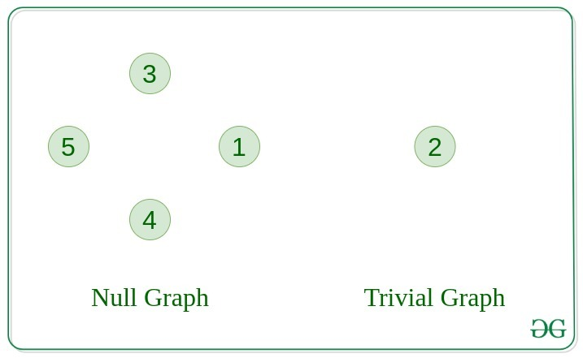
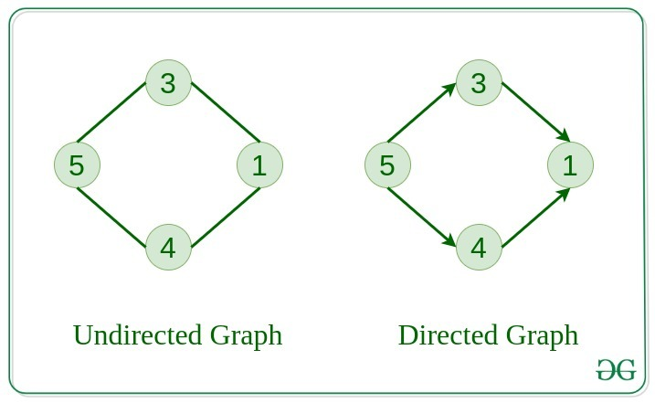
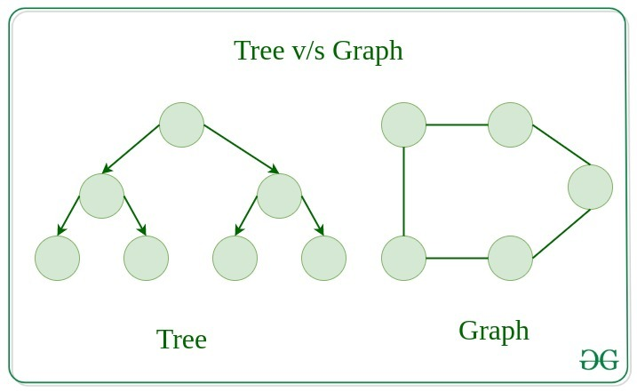
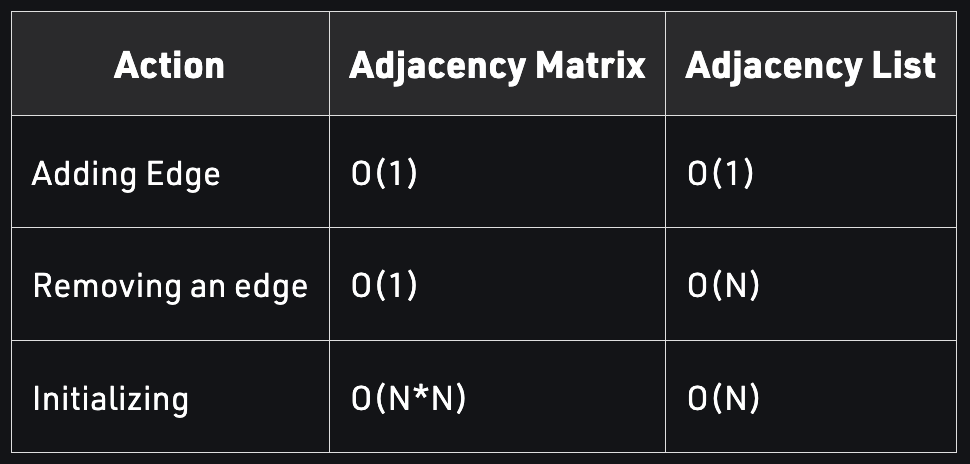

# Graphs

---

## Introduction

---

A Graph is a non-linear data structure consisting of vertices and edges. The vertices are sometimes also referred to as nodes and the edges are lines or arcs that connect any two nodes in the graph. More formally a Graph is composed of a set of vertices( V ) and a set of edges( E ). The graph is denoted by G(V, E).

Graphs are a set of nodes, and a set of edges between the nodes.

Nodes connected by an edge are called _adjacent_ (aka _neighbors_).

 

## Components of a graph

---

- Vertices: Vertices are the fundamental units of the graph. Sometimes, vertices are also known as vertex or nodes. Every node/vertex can be labeled or unlabelled.
- Edges: Edges are drawn or used to connect two nodes of the graph. It can be ordered pair of nodes in a directed graph. Edges can connect any two nodes in any possible way. There are no rules. Sometimes, edges are also known as arcs. Every edge can be labelled/unlabelled.

 

## Properties of Graphs

---

The basic properties of a graph include:
1. Vertices (nodes): The points where edges meet in a graph are known as vertices or nodes. A vertex can represent a physical object, concept, or abstract entity.
2. Edges: The connections between vertices are known as edges. They can be undirected (bidirectional) or directed (unidirectional).
3. Weight: A weight can be assigned to an edge, representing the cost or distance between two vertices. A weighted graph is a graph where the edges have weights.
4. Degree: The degree of a vertex is the number of edges that connect to it. In a directed graph, the in-degree of a vertex is the number of edges that point to it, and the out-degree is the number of edges that start from it.
5. Path: A path is a sequence of vertices that are connected by edges. A simple path does not contain any repeated vertices or edges.
6. Cycle: A cycle is a path that starts and ends at the same vertex. A simple cycle does not contain any repeated vertices or edges.
7. Connectedness: A graph is said to be connected if there is a path between any two vertices. A disconnected graph is a graph that is not connected.
8. Planarity: A graph is said to be planar if it can be drawn on a plane without any edges crossing each other.
9. Bipartiteness: A graph is said to be bipartite if its vertices can be divided into two disjoint sets such that no two vertices in the same set are connected by an edge.

> **O(n) <= #edges <= O(n^2)**
>
> **sparse graph: #edges << #nodes**
>
> **dense graph: #edges ~ #nodes**

## Types

---

### 1. Null Graph

---

- A graph is known as a null graph if there are no edges in the graph.

 

### 2. Trivial Graph

---

- Graph having only a single vertex, it is also the smallest graph possible.

 

### 3. Undirected Graph

---

- A graph in which edges do not have any direction. That is the nodes are unordered pairs in the definition of every edge. 

 

### 4. Directed Graph

---

- A graph in which edge has direction. That is the nodes are ordered pairs in the definition of every edge.

Directed graphs can contain _cycles_ (we call these graphs _cyclic_)

Nodes within a directed graph can be _weakly_ or _strongly_ connected.

_weakly connected_ means that there is a path between the nodes.

_strongly connected_ means that there is a path between the nodes in both directions.

 

### 5. Connected Graph

---

- The graph in which from one node we can visit any other node in the graph is known as a connected graph.

 

### 6. Disconnected Graph

---

- The graph in which at least one node is not reachable from a node is known as a disconnected graph.

 

### 7. Regular Graph

---

- The graph in which the degree of every node (vertex) is equal to K is called K regular graph.

 

### 8. Complete Graph

---

- The graph in which from each node there is an edge to each other node.

 

### 9. Cycle Graph

---

- The graph in which the graph is a cycle in itself, the degree of each vertex is 2.

 

### 10. Cyclic Graph

---

- A graph containing at least one cycle is known as a Cyclic graph.

 

### 11. Directed Acyclic Graph

---

- A Directed Graph that does not contain any cycle.

 

### 12. Bipartite Graph

---

- A graph in which vertex can be divided into two sets such that vertex in each set does not contain any edge between them.

 

### 13. Weighted Graph

---

- A graph in which the edges are already specified with suitable weight is known as a weighted graph. 
- Weighted graphs can be further classified as directed weighted graphs and undirected weighted graphs.

 

## Tree vs Graph

---

- Trees are the restricted types of graphs, just with some more rules.
- Every tree will always be a graph but not all graphs will be trees.
- Linked List, Trees, and Heaps all are special cases of graphs.

 

## Representation of Graphs

---

There are two ways to store a graph:
- ### Adjacency Matrix
- ### Adjacency List

### Adjacency Matrix

---

- In this method, the graph is stored in the form of the 2D matrix where rows and columns denote vertices.
- Each entry in the matrix represents the weight of the edge between those vertices.

 

### Adjacency List

---

- This graph is represented as a collection of linked lists.
- There is an array of pointer which points to the edges connected to that vertex.

 

### Adjacency List vs Adjacency Matrix

---

- When the graph contains a large number of edges then it is good to store it as a matrix because only some entries in the matrix will be empty.
- An algorithm such as Prim’s and Dijkstra adjacency matrix is used to have less complexity.

 

### Real-Life Applications of Graph

---

