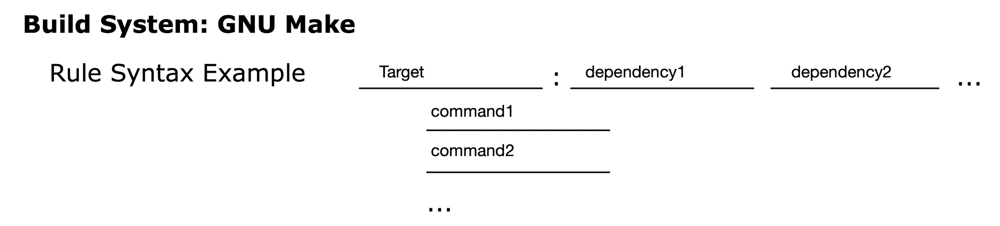
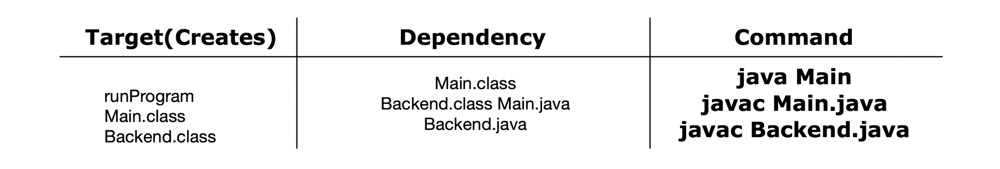
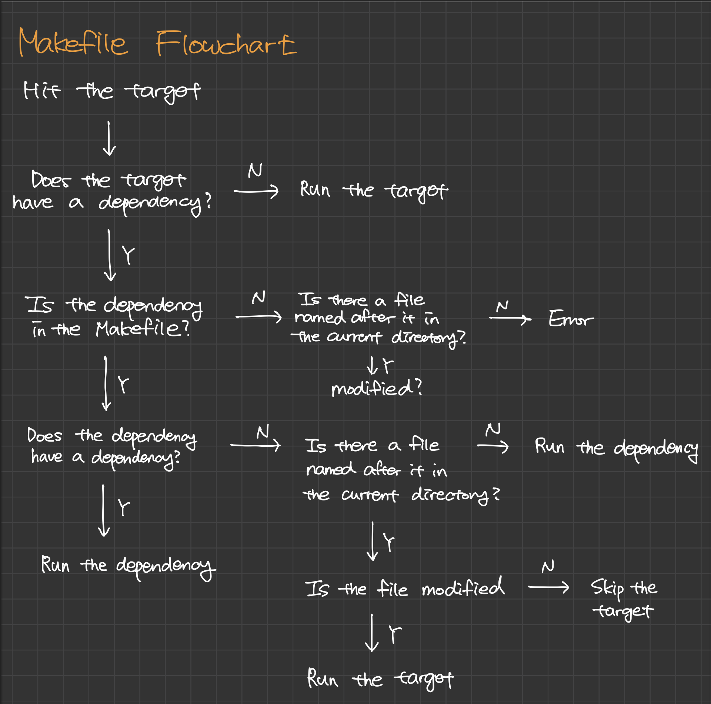

# GNU Make

---

<br>

### GNU Make Rule Syntax

---



<br><br>

### Target / Dependency / Command

---



<br><br>

### Makefile Flowchart

---



<br><br>

### Makefile Example

---

Consider a directory that contains the following Makefile along with files named avacado.txt, brocoli.txt, celery.txt, and dill.txt that were created (and last edited) in alphabetical order.

```makefile
runProgram: avocado.txt
    touch edamame.txt
avocado.txt: celery.txt dill.txt
    echo A
broccoli.txt:
    echo B
celery.txt: broccoli.txt
    echo C
dill.txt: edamame.txt
    echo D
edamame.txt:
    echo E
```

<br><br>

When running "make" in this directory, the following bash commands will be evaluated in order:

```bash
echo E
echo D
echo A
touch edamame.txt
```

<br><br>

Step-by-step explanation:

1. The first target is "runProgram", which depends on "avocado.txt". We will now look at the target "avocado.txt".
2. The target "avocado.txt" depends on "celery.txt" and "dill.txt". We will now look at the target "celery.txt".
3. The target "celery.txt" depends on "broccoli.txt". However, notice that the target is older than the dependency. Therefore, the command "echo C" will not be evaluated.
4. The target "dill.txt" depends on "edamame.txt". We will now look at the target "edamame.txt".
5. The target "edamame.txt" does not have a dependency. echo E will be evaluated.
6. Going back up, we return to the target "dill.txt". echo D will be evaluated.
7. Going back up, we return to the target "avocado.txt". echo A will be evaluated.
8. Going back up, we return to the target "runProgram". The command "touch edamame.txt" will be evaluated.
